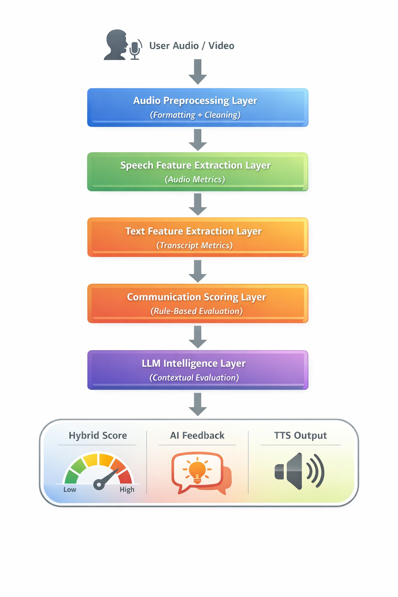

# 🎙️ SpeakClear AI

SpeakClear AI is a premium, AI-driven communication analysis platform designed to help users master their verbal impact. By providing real-time audio and video analysis, SpeakClear identifies speech patterns, filler words, and delivers tailored AI coaching to transform how you speak.


## ✨ Core Features

- **🚀 Real-time Assessment**: Record audio or video responses to professional topics and get instant metrics.
- **📊 Advanced Metrics**:
  - **WPM (Words Per Minute)** track your speaking pace.
  - **Filler Word Detection** identify and eliminate "um", "ah", and "like".
  - **Speech Ratio** analyze active speaking time vs. silence.
- **🤖 AI Coaching**: Receive personalized feedback and actionable improvement suggestions powered by LLMs.
- **📈 Performance Tracking**: Visualize your growth over time with interactive charts and session history.
- **🔒 Secure Profiles**: Protected user accounts and personal session management.
- **🎨 Premium UI**: A modern, dark-themed interface built for a seamless user experience.

## 🛠️ Tech Stack

- **Frontend**: [Next.js](https://nextjs.org/), [Tailwind CSS](https://tailwindcss.com/), [Framer Motion](https://www.framer.com/motion/)
- **Backend**: [FastAPI](https://fastapi.tiangolo.com/), [Uvicorn](https://www.uvicorn.org/)
- **AI/ML**: [OpenAI GPT](https://openai.com/), [Librosa](https://librosa.org/) (Audio Analysis)
- **Database**: [SQLite](https://www.sqlite.org/)
- **Processing**: [FFmpeg](https://ffmpeg.org/), MoviePy, Pydub

## 🚀 Getting Started

### Prerequisites

- Python 3.10+
- Node.js 18+
- OpenAI API Key

### Setup

1. **Clone the repository**:
   ```bash
   git clone https://github.com/GiriPrasathGA/AI-communication-Analysis-main.git
   cd AI-communication-Analysis-main
   ```

2. **Backend Setup**:
   - Create a virtual environment: `python -m venv .venv`
   - Activate it: `.venv\Scripts\activate` (Windows) or `source .venv/bin/activate` (Mac/Linux)
   - Install dependencies: `pip install -r backend/requirements.txt`
   - Create a `.env` file in the `backend/` directory and add your `OPENAI_API_KEY`.

3. **Frontend Setup**:
   - Navigate to the UI folder: `cd speakclear-ui`
   - Install dependencies: `npm install`

### Running the Application

For Windows users, you can use the provided PowerShell script to start both servers simultaneously:

```powershell
./run_servers.ps1
```

Alternatively, run them in separate terminals:

**Backend**:
```bash
cd backend
uvicorn app:app --port 8010 --reload
```

**Frontend**:
```bash
cd speakclear-ui
npm run dev
```

The application will be available at `http://localhost:3000`.

## System Architecture



## 📜 License

This project is licensed under the MIT License - see the LICENSE file for details.
